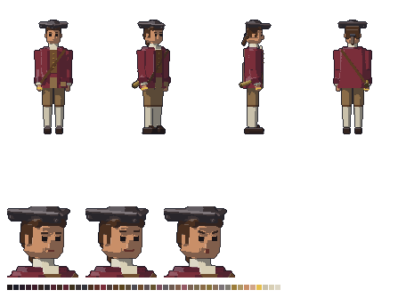

# Baltazar — visual

Rapaz de uns 20 anos do Ceará colonial (~1750), filho de colonos de sítio e antepassado do Gabriel. Quem ele é está na ficha [`docs/historia/personagens/baltazar.md`](../../../../docs/historia/personagens/baltazar.md), que faz parte do Enredo Principal (a lei do projeto).



## Quem ele é, no visual

- **Século XVIII à primeira vista.** **Tricórnio** de feltro (três abas viradas para cima, uma ponta para a frente), cabelo comprido preso atrás com uma **fita** (o rabicho), **casaca** aberta até o meio da coxa com **canhões** largos nas mangas, **colete** marrom com botões de latão, **camisa de linho** aberta no pescoço, **calções** até o joelho, meias claras e **sapato de fivela**.
- **De sítio, não de corte.** Tecidos simples e gastos pelos dias em 3026, com um **remendo** na casaca e a borda do chapéu gasta. Nada de renda, galão ou peruca.
- **A luneta de latão** sempre junto, pendurada no quadril direito por uma **bandoleira de couro** (o mesmo latão queimado da luneta do acampamento na Biblioteca).
- **O anel** de ouro, novo, na mão direita: o mesmo que o Gabriel tem gasto. É um pixel de ouro chapado, para não sumir na mão.
- **Cor de identificação: vinho**, o tom do pau-brasil, a tinta da colônia. É um eco escuro do vermelho do Gabriel: a mesma família, mil anos antes. O chapéu e a silhueta de casaca separam os dois na tela.
- **Postura:** em pé direito, cerimonioso, a cabeça um pouco para a frente, de quem quer olhar tudo de perto. Passo curto e cuidadoso.
- A luneta e o anel ficam do lado **direito** dele, o lado virado para a câmera nas vistas de lado e de 3/4.

## Sprites

Todos em `assets/sprites/personagens/baltazar/`, gerados por `assets/modelagem/personagens/gerar_baltazar.py` (Blender, sem abrir a janela). São os mesmos arquivos e tamanhos do Gabriel:

| Arquivo | Tamanho | O que é |
|---|---|---|
| `baltazar_<vista>.png` | 96 × 112 | parado, em cada vista: `lado`, `frente`, `tres_quartos`, `costas`, `tres_quartos_costas` |
| `baltazar_andar_<vista>.png` | 12 quadros de 96 × 112 | caminhada (dois passos), um arquivo por vista |
| `baltazar_parado_<vista>.png` | 8 quadros de 96 × 112 | respirando, um arquivo por vista |
| `baltazar_retrato_normal.png` | 80 × 80 | a seriedade cerimoniosa (mostrado em 40 × 40) |
| `baltazar_retrato_encantado.png` | 80 × 80 | sorriso e sobrancelhas lá em cima: tudo em 3026 é um milagre |
| `baltazar_retrato_aflito.png` | 80 × 80 | boca aberta e sobrancelhas levantadas no meio: a hora do latim |
| `baltazar_referencia.png` | — | frente, 3/4, lado e costas, e os retratos |

- **Escala:** a mesma de todos os personagens (1,75 m do Gabriel = 48 px na tela). Ele tem 1,63 m de corpo; o tricórnio passa disso.
- **Resolução dobrada:** como o Gabriel, a cena usa `scale = Vector2(0.5, 0.5)` e `offset = Vector2(-46, -108)`. Para a esquerda, o Godot espelha o sprite de lado.
- **Caminhada e respiração:** as do `comum.py`, com o passo mais curto (`PASSO` no script).
- **Paleta:** 44 cores para tudo.

## No jogo

`cenas/personagens/baltazar.tscn`: parado, respirando, com os pés sólidos (o Gabriel não atravessa). O script é o `scripts/personagens/personagem_parado.gd`, que escolhe a vista (`vista`) e se ele olha para a esquerda (`olhando_para_esquerda`). Por enquanto só aparece na sala de teste (`cenas/salas/sala_teste.tscn`). Em que fase o Gabriel o encontra e onde fica o esconderijo dele estão pendentes na ficha.

## Para mudar

Edite `gerar_baltazar.py` (cores em `criar_materiais`, peças em `montar`, `cabeca` e `tricornio`, expressões em `expressao`, jeito de andar em `PASSO`) e rode:

```
blender -b --factory-startup --python assets/modelagem/personagens/gerar_baltazar.py
```

Leva uns 2 minutos e sobrescreve todos os PNGs e o `baltazar.blend`.
