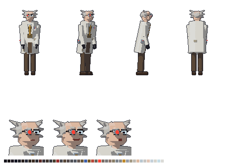

# Carlos — visual

> [!WARNING]
> O Carlos é a **ideia 23** de [`docs/historia/outras_ideias.md`](../../../../docs/historia/outras_ideias.md), **ainda não aprovada**. Ele não tem ficha em `docs/historia/personagens/` e não faz parte do Enredo Principal. Este é o visual dele caso a ideia entre; se a ideia mudar, o visual muda junto.

Cientista que já vivia em 3026 e criou a Âncora. Quando a humanidade foi embora, ele ficou, obcecado por uma época antiga (a ideia sugere os anos 60), para fugir para ela.



## Quem ele é, no visual

O "cientista maluco":

- **Mais velho que o grupo** (que tem uns 20 anos): cabelo grisalho **arrepiado em mechas** dos lados e atrás, **careca** no alto, sobrancelhas grossas, magro e pálido de quem vive trancado no laboratório.
- **O cientista:** **jaleco** comprido até perto do joelho, sujo e manchado, canetas no bolso do peito, **luvas de borracha** pretas.
- **A obsessão pela época antiga**, por baixo do jaleco: colete de tricô, camisa clara, **gravata fina** mostarda, calça de tergal marrom, sapato social e **óculos de aro grosso**, como um professor dos anos 60.
- **O lado de 3026:** uma **lupa articulada com lente vermelha** presa nos óculos, sobre o olho direito, e um **controle com luz vermelha** no cinto. É o mesmo vermelho dos olhos dos robôs: na ideia, ele controla parte deles.
- **Cor de identificação: o branco sujo do jaleco**, com o ponto vermelho. Ninguém mais no jogo usa branco.
- **Postura:** curvado para a frente, a cabeça esticada, os braços um pouco para a frente. Passo curto (o jaleco atrapalha) e respiração agitada.
- A lupa e o controle ficam do lado **direito** dele, virado para a câmera nas vistas de lado e de 3/4.

## Sprites

Todos em `assets/sprites/personagens/carlos/`, gerados por `assets/modelagem/personagens/gerar_carlos.py` (Blender, sem abrir a janela). São os mesmos arquivos e tamanhos do Gabriel:

| Arquivo | Tamanho | O que é |
|---|---|---|
| `carlos_<vista>.png` | 96 × 112 | parado, em cada vista: `lado`, `frente`, `tres_quartos`, `costas`, `tres_quartos_costas` |
| `carlos_andar_<vista>.png` | 12 quadros de 96 × 112 | caminhada (dois passos), um arquivo por vista |
| `carlos_parado_<vista>.png` | 8 quadros de 96 × 112 | respirando, um arquivo por vista |
| `carlos_retrato_normal.png` | 80 × 80 | boca reta, sobrancelhas retas (mostrado em 40 × 40) |
| `carlos_retrato_maniaco.png` | 80 × 80 | sorriso aberto e sobrancelhas lá em cima: o cientista maluco |
| `carlos_retrato_furioso.png` | 80 × 80 | boca aberta e sobrancelhas baixas, viradas para o meio |
| `carlos_referencia.png` | — | frente, 3/4, lado e costas, e os retratos |

- **Escala:** a mesma de todos os personagens (1,75 m do Gabriel = 48 px na tela). Ele tem 1,80 m de corpo, mas curvado.
- **Resolução dobrada:** como o Gabriel, a cena usa `scale = Vector2(0.5, 0.5)` e `offset = Vector2(-46, -108)`.
- **Caminhada e respiração:** as do `comum.py`, com o passo curto e a cabeça balançando mais (`PASSO` e `RESPIRAR` no script).
- **Paleta:** 47 cores para tudo.

## No jogo

`cenas/personagens/carlos.tscn`: parado, respirando, com os pés sólidos (o Gabriel não atravessa). O script é o `scripts/personagens/personagem_parado.gd`, que escolhe a vista (`vista`) e se ele olha para a esquerda (`olhando_para_esquerda`). Por enquanto só aparece na sala de teste (`cenas/salas/sala_teste.tscn`). O papel dele na história depende da aprovação da ideia 23.

## Para mudar

Edite `gerar_carlos.py` (cores em `criar_materiais`, peças em `montar` e `cabeca`, expressões em `expressao`, jeito de andar em `PASSO`) e rode:

```
blender -b --factory-startup --python assets/modelagem/personagens/gerar_carlos.py
```

Leva uns 2 minutos e sobrescreve todos os PNGs e o `carlos.blend`.
