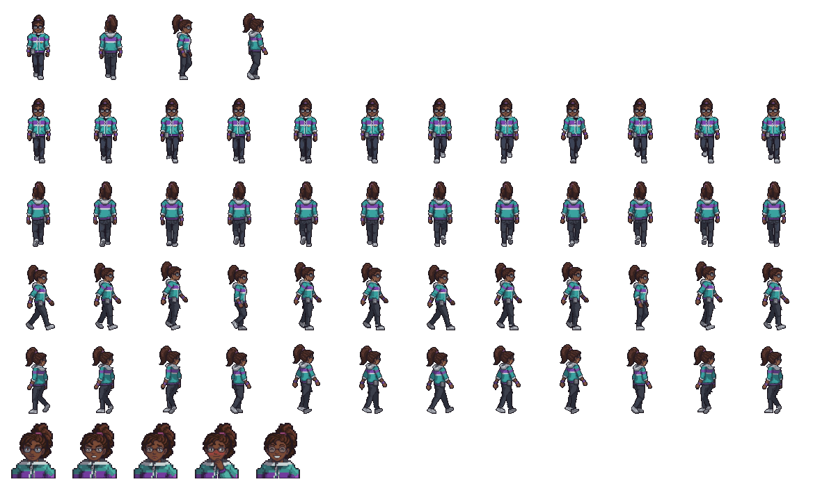

# Clarice — visual

Aluna de processamento de dados puxada de uma madrugada de 1994. Está em 3026 há alguns dias, escondida no bunker embaixo do núcleo da Âncora. Quem ela é está na ficha [`docs/historia/personagens/clarice.md`](../../../../docs/historia/personagens/clarice.md), que faz parte do Enredo Principal (a lei do projeto).



## Quem ela é, no visual

- **Anos 90 de verdade.** Jaqueta **corta-vento em blocos de cor** (verde-azulado, faixa roxa e faixa branca no peito, barra roxa), cabelo **cacheado e volumoso preso no alto com uma xuxinha magenta**, **óculos grandes**, **fone de walkman de espuma laranja** caído no pescoço, o **walkman** no cós da calça com o fio subindo, tênis branco de lona e calça preta.
- **Dias no bunker.** Mangas arregaçadas até o cotovelo, relógio digital no pulso, e a estação de trabalho montada com o que ela achou.
- **Cor de identificação: verde-azulado**, o oposto do vermelho do Gabriel. Lado a lado, cada um se destaca do outro.
- **Postura:** no bunker, sentada o tempo todo (ela fica fixa na central de dados). Digitando, inclinada para os monitores; conversando, gira a cadeira e se encosta, meio de lado: não para tudo por causa do Gabriel.

## A estação de trabalho

Renderizada junto com ela, no mesmo sprite:

- mesa de metal com tampo de fórmica marrom e gaveteiro;
- **três monitores de tubo** (CRT) com a tela de **fósforo verde** e linhas de texto, os dois dos lados virados para ela;
- teclado e mouse bege, **gabinete bege** no chão com o LED aceso e o drive de disquete;
- o **telefone bege** com o fio enrolado: é por ele que ela liga para os telefones velhos do campus;
- pilha de disquetes, caneca vermelha, papéis e os **adesivos** rosa e amarelo nas molduras (os mesmos do bilhete dela);
- cadeira de escritório giratória, de cinco patas.

## Sprites

Todos em `assets/sprites/personagens/clarice/`, gerados por `assets/modelagem/personagens/gerar_clarice.py` (Blender, sem abrir a janela):

| Arquivo | Tamanho | O que é |
|---|---|---|
| `clarice_digitando.png` | 8 quadros de 160 × 128 | de costas para a câmera, digitando (as mãos e a cabeça acompanham o texto) |
| `clarice_virando.png` | 5 quadros de 160 × 128 | a cadeira girando até ela olhar para a esquerda |
| `clarice_olhando.png` | 6 quadros de 160 × 128 | virada para o Gabriel, respirando |
| `clarice_retrato_normal.png` | 80 × 80 | retrato da caixa de diálogo (mostrado em 40 × 40) |
| `clarice_retrato_sorrindo.png` | 80 × 80 | boca mais larga com os cantos para cima, sobrancelhas erguidas (o sorrisinho de quem já sabe o que você vai dizer) |
| `clarice_retrato_seria.png` | 80 × 80 | boca curta, sobrancelhas baixas e inclinadas |
| `clarice_<vista>.png` | 96 × 112 | em pé, parada, nas vistas do Gabriel: `lado`, `frente`, `tres_quartos`, `costas`, `tres_quartos_costas` |
| `clarice_andar_<vista>.png` | 12 quadros de 96 × 112 | caminhada, um arquivo por vista |
| `clarice_parado_<vista>.png` | 8 quadros de 96 × 112 | em pé respirando, um arquivo por vista |
| `clarice_referencia.png` | — | em pé (frente, 3/4, lado, costas), sentada e os retratos |

- **Escala:** a mesma de todos os personagens (1,75 m do Gabriel = 48 px na tela). Ela tem 1,62 m.
- **Resolução dobrada:** os sprites saem com o dobro de pixels (`RESOLUCAO = 2` no script) e a cena usa escala 0,5. Na tela ela ocupa o mesmo espaço, com o dobro de detalhe (óculos, rosto, texto nos monitores).
- **Em pé:** os sprites têm o mesmo conjunto e os mesmos tamanhos do Gabriel (`comum.py`, item 7), para quando ela andar pelo campus. Usam a paleta já calculada, então as cores dos sprites sentados não mudam. A cena `cenas/personagens/clarice_em_pe.tscn` mostra a Clarice parada, respirando (script `personagem_parado.gd`), e por enquanto só está na sala de teste.
- **Câmera da estação:** inclinada 22° para baixo, para aparecer o tampo da mesa e o teclado, como os objetos 2.5D do cenário.
- **O pé do sprite** (o ponto do nó no Godot) é o chão na frente da cadeira: `scale = Vector2(0.5, 0.5)` e `offset = Vector2(-80, -120)`.
- **Detalhe:** o corpo dela usa `DETALHE = 3` e sombreamento suave (ver `comum.py`): cones e esferas com três vezes mais gomos, quinas arredondadas, mais cachos no cabelo, o zíper aberto da jaqueta, bolsos, cadarço e um botton de carinha amarela no peito. O rosto fica chapado (com luz suave, a parte de baixo escurecia e parecia barba). A estação de trabalho fica no detalhe normal: monitor de tubo é caixa.
- **Paleta:** 53 cores para tudo (sprites e retratos). O brilho do cabelo foi trocado por um castanho claro quente, porque o brilho padrão (puxado para o branco frio) deixava o cabelo cinza.

## No jogo

`cenas/personagens/clarice.tscn`, na central de dados do bunker. O script (`scripts/personagens/clarice.gd`) faz:

- **longe do Gabriel:** digitando, com o som do teclado;
- **Gabriel a menos de 80 px, ou conversando:** a cadeira gira (quadros de `virando`) e ela fica olhando para ele;
- **ele se afasta:** gira de volta e volta a digitar.

Ela tem a colisão da mesa e da cadeira, a luz verde dos monitores (uma PointLight2D que treme de leve) e a conversa (`[E] Conversar`), com os diálogos em `dados/dialogos/clarice_*.json`.

## Para mudar

Edite `gerar_clarice.py` (cores no começo, poses em `pose_digitando` e `pose_relaxada`, expressões em `expressao`) e rode:

```
blender -b --factory-startup --python assets/modelagem/personagens/gerar_clarice.py
```

Leva uns 2 minutos (os sprites em pé são a maior parte) e sobrescreve todos os PNGs e o `clarice.blend`.
