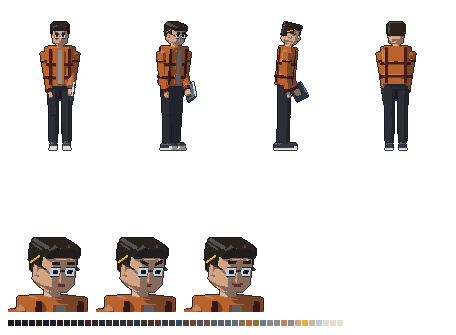

# Henrique — visual

Henrique, o pesquisador: aluno de iniciação científica da Unifor em 2019, com uns 20 anos. Quem ele é está na ficha [`docs/historia/personagens/henrique.md`](../../../../docs/historia/personagens/henrique.md), que faz parte do Enredo Principal (a lei do projeto).



## Quem ele é, no visual

- **2019.** Camisa de **flanela xadrez** aberta por cima de uma camiseta cinza, calça jeans preta e tênis de lona escuro com biqueira e sola brancas.
- **O aluno que anota tudo.** O **caderno** de capa dura sempre na mão esquerda, com o elástico, e um **lápis atrás da orelha** direita.
- **Noites em cima das contas.** Óculos redondos de aro fino e o cabelo escuro bagunçado, com a franja caindo na testa.
- **Cor de identificação: laranja-queimado** da flanela. Gabriel vermelho, Clarice verde-azulado, Zane amarelo-ácido, Baltazar vinho, Rafael azul-celeste, Carlos branco.
- **Postura:** o contrário do Zane. Ombros fechados, cabeça baixa, braços colados ao corpo, passo curto: quem não quer ocupar espaço.
- O lápis fica do lado **direito** dele, virado para a câmera nas vistas de lado e de 3/4.

## Sprites

Todos em `assets/sprites/personagens/henrique/`, gerados por `assets/modelagem/personagens/gerar_henrique.py` (Blender, sem abrir a janela). São os mesmos arquivos e tamanhos do Gabriel:

| Arquivo | Tamanho | O que é |
|---|---|---|
| `henrique_<vista>.png` | 96 × 112 | parado, em cada vista: `lado`, `frente`, `tres_quartos`, `costas`, `tres_quartos_costas` |
| `henrique_andar_<vista>.png` | 12 quadros de 96 × 112 | caminhada (dois passos), um arquivo por vista |
| `henrique_parado_<vista>.png` | 8 quadros de 96 × 112 | respirando, um arquivo por vista |
| `henrique_retrato_normal.png` | 80 × 80 | o rosto fechado de quem pensa (mostrado em 40 × 40) |
| `henrique_retrato_nervoso.png` | 80 × 80 | boca curta e sobrancelhas levantadas no meio: a ansiedade de quem desconfia ter causado tudo |
| `henrique_retrato_timido.png` | 80 × 80 | um sorriso pequeno e as sobrancelhas um pouco erguidas |
| `henrique_referencia.png` | — | frente, 3/4, lado e costas, e os retratos |

- **Escala:** a mesma de todos os personagens (1,75 m do Gabriel = 48 px na tela). Ele tem 1,76 m, mas curvado.
- **Resolução dobrada:** como o Gabriel, a cena usa `scale = Vector2(0.5, 0.5)` e `offset = Vector2(-46, -108)`.
- **Caminhada e respiração:** as do `comum.py`, com o passo curto e o braço quase parado (`PASSO` no script).
- **Paleta:** 48 cores para tudo.

## No jogo

`cenas/personagens/henrique.tscn`: parado, respirando, com os pés sólidos (o Gabriel não atravessa). O script é o `scripts/personagens/personagem_parado.gd`, que escolhe a vista (`vista`) e se ele olha para a esquerda (`olhando_para_esquerda`). Por enquanto só aparece na sala de teste (`cenas/salas/sala_teste.tscn`). Como ele aparece na história e onde fica estão pendentes na ficha.

## Para mudar

Edite `gerar_henrique.py` (cores em `criar_materiais`, peças em `montar`, `cabeca` e `caderno`, expressões em `expressao`, jeito de andar em `PASSO`) e rode:

```
blender -b --factory-startup --python assets/modelagem/personagens/gerar_henrique.py
```

Leva uns 2 minutos e sobrescreve todos os PNGs e o `henrique.blend`.
