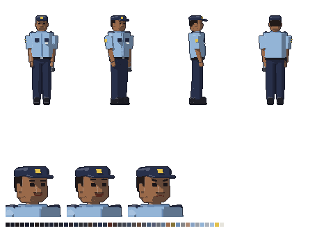

# Rafael — visual

Segurança noturno da Unifor em 2008, no primeiro emprego, com uns 20 anos. Quem ele é está na ficha [`docs/historia/personagens/rafael.md`](../../../../docs/historia/personagens/rafael.md), que faz parte do Enredo Principal (a lei do projeto).



## Quem ele é, no visual

- **Uniforme de vigilante de 2008.** Camisa de manga curta **azul-celeste** com dragonas e bolsos azul-marinho, **emblema amarelo** de segurança na manga e no boné, **crachá** no peito, calça azul-marinho, cinto preto com fivela de metal e **coturno**.
- **O uniforme é grande para ele.** Camisa larga, mangas folgadas e compridas, quase no cotovelo, e calça folgada: um rapaz magro dentro da roupa de um homem mais velho.
- **Tentando parecer mais velho** ("Seu Rafael"): um **bigodinho ralo**, que aparece até no sprite de jogo, e o boné bem enterrado na cabeça.
- **No cinto**, o **rádio HT** no quadril direito (o mesmo do inventário: plástico preto, antena de borracha, visor esverdeado) e a **lanterna antiga** de metal no esquerdo.
- **Cor de identificação: azul-celeste.** Gabriel vermelho, Clarice verde-azulado, Zane amarelo-ácido, Baltazar vinho.
- **Postura:** peito estufado de quem está de serviço, passo de ronda.
- O rádio fica do lado **direito** dele, virado para a câmera nas vistas de lado e de 3/4: é por ele que o Rafael fala com o Gabriel.

## Sprites

Todos em `assets/sprites/personagens/rafael/`, gerados por `assets/modelagem/personagens/gerar_rafael.py` (Blender, sem abrir a janela). São os mesmos arquivos e tamanhos do Gabriel:

| Arquivo | Tamanho | O que é |
|---|---|---|
| `rafael_<vista>.png` | 96 × 112 | parado, em cada vista: `lado`, `frente`, `tres_quartos`, `costas`, `tres_quartos_costas` |
| `rafael_andar_<vista>.png` | 12 quadros de 96 × 112 | caminhada (dois passos), um arquivo por vista |
| `rafael_parado_<vista>.png` | 8 quadros de 96 × 112 | respirando, um arquivo por vista |
| `rafael_retrato_normal.png` | 80 × 80 | meio sorriso: caloroso (mostrado em 40 × 40) |
| `rafael_retrato_rindo.png` | 80 × 80 | boca aberta num riso, sobrancelhas erguidas: o brincalhão |
| `rafael_retrato_triste.png` | 80 × 80 | cantos da boca para baixo, sobrancelhas levantadas no meio: a hora em que ele admite que não é reforma |
| `rafael_referencia.png` | — | frente, 3/4, lado e costas, e os retratos |

- **Escala:** a mesma de todos os personagens (1,75 m do Gabriel = 48 px na tela). Ele tem 1,72 m.
- **Resolução dobrada:** como o Gabriel, a cena usa `scale = Vector2(0.5, 0.5)` e `offset = Vector2(-46, -108)`. Para a esquerda, o Godot espelha o sprite de lado.
- **Caminhada e respiração:** as do `comum.py`, com o braço balançando um pouco mais (`PASSO` no script).
- **Paleta:** 46 cores para tudo.

## No jogo

Ainda não tem cena: por enquanto ele só fala pelo rádio. Onde fica o posto de guarda e em que fase o Gabriel o encontra estão pendentes na ficha. Para pôr numa sala, dá para fazer como a `cenas/personagens/zane.tscn` (script `personagem_parado.gd`).

## Para mudar

Edite `gerar_rafael.py` (cores em `criar_materiais`, peças em `montar` e `cabeca`, expressões em `expressao`, jeito de andar em `PASSO`) e rode:

```
blender -b --factory-startup --python assets/modelagem/personagens/gerar_rafael.py
```

Leva uns 2 minutos e sobrescreve todos os PNGs e o `rafael.blend`.
