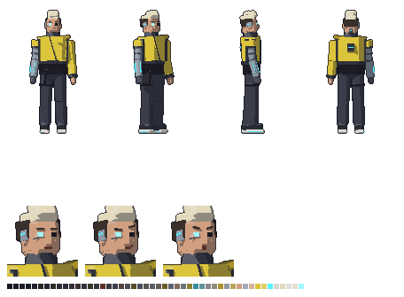

# Zane — visual

Rapaz de uns 20 anos, de 2123, o último a chegar em 3026. Quem ele é está na ficha [`docs/historia/personagens/zane.md`](../../../../docs/historia/personagens/zane.md), que faz parte do Enredo Principal (a lei do projeto).



## Quem ele é, no visual

- **Implantes à vista.** O **braço direito** inteiro é uma prótese de metal, com a junta do cotovelo à mostra e **linhas de luz ciano** no antebraço. O **olho direito** é um implante que brilha, com uma **placa de metal na têmpora** (dois pontos de luz) e uma **porta de conexão na nuca**. O ciano é o mesmo da interface holográfica dos áudios dele.
- **Roupa de um futuro que ninguém reconhece.** Jaqueta técnica curta **amarelo-ácido** com painéis grafite nos lados, **zíper na diagonal**, **gola alta** até o queixo, ombreira no ombro esquerdo e uma faixa de luz no peito; a manga do braço de metal é cortada no ombro. Embaixo, a **camiseta preta comprida** aparece. Calça larga e reta com tiras, **botas de sola branca grossa** com um friso de luz.
- **Cabelo** raspado dos lados e na nuca, com o **topo descolorido**, quase branco, subindo num topete: a silhueta mais alta e pontuda do grupo.
- **Cor de identificação: amarelo-ácido.** O Gabriel é vermelho, a Clarice é verde-azulado, e nenhum cenário tem esse amarelo. Ele destoa de todo mundo, como a ficha pede.
- **Postura:** o contrário do Gabriel cansado. Peito aberto, queixo erguido, braços um pouco afastados e um passo largo e saltado.
- Os implantes ficam do lado **direito** dele, o lado virado para a câmera nas vistas de lado e de 3/4 e no retrato.

## Sprites

Todos em `assets/sprites/personagens/zane/`, gerados por `assets/modelagem/personagens/gerar_zane.py` (Blender, sem abrir a janela). São os mesmos arquivos e tamanhos do Gabriel:

| Arquivo | Tamanho | O que é |
|---|---|---|
| `zane_<vista>.png` | 96 × 112 | parado, em cada vista: `lado`, `frente`, `tres_quartos`, `costas`, `tres_quartos_costas` |
| `zane_andar_<vista>.png` | 12 quadros de 96 × 112 | caminhada (dois passos), um arquivo por vista |
| `zane_parado_<vista>.png` | 8 quadros de 96 × 112 | respirando, um arquivo por vista |
| `zane_retrato_normal.png` | 80 × 80 | retrato da caixa de diálogo (mostrado em 40 × 40) |
| `zane_retrato_confiante.png` | 80 × 80 | sorriso de lado e uma sobrancelha erguida |
| `zane_retrato_assustado.png` | 80 × 80 | boca aberta e sobrancelhas levantadas no meio: o medo que ele não admite |
| `zane_referencia.png` | — | frente, 3/4, lado e costas, e os retratos |

- **Escala:** a mesma de todos os personagens (1,75 m do Gabriel = 48 px na tela). O corpo dele tem 1,80 m, e o topete passa disso.
- **Resolução dobrada:** como o Gabriel, os sprites saem com o dobro de pixels e a cena usa `scale = Vector2(0.5, 0.5)`. Para a esquerda, o Godot espelha o sprite de lado.
- **Caminhada e respiração:** as do `comum.py`, com amplitudes próprias (`PASSO` e `RESPIRAR` no script).
- **Paleta:** 48 cores para tudo.

## No jogo

`cenas/personagens/zane.tscn`: o Zane parado, respirando, com os pés sólidos (o Gabriel não atravessa). O script é o `scripts/personagens/personagem_parado.gd`, que escolhe a vista (`vista`) e se ele olha para a esquerda (`olhando_para_esquerda`). Por enquanto ele só aparece na sala de teste (`cenas/salas/sala_teste.tscn`). Onde ele aparece na história e a função dele na jogabilidade estão pendentes na ficha.

## Para mudar

Edite `gerar_zane.py` (cores em `criar_materiais`, peças em `montar` e `cabeca`, expressões em `expressao`, jeito de andar em `PASSO`) e rode:

```
blender -b --factory-startup --python assets/modelagem/personagens/gerar_zane.py
```

Leva uns 2 minutos e sobrescreve todos os PNGs e o `zane.blend`.
