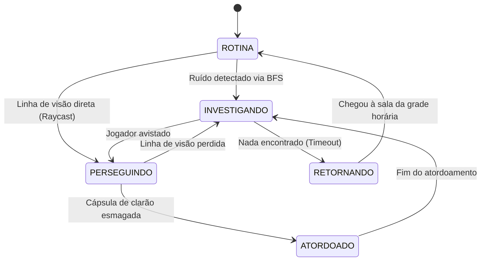
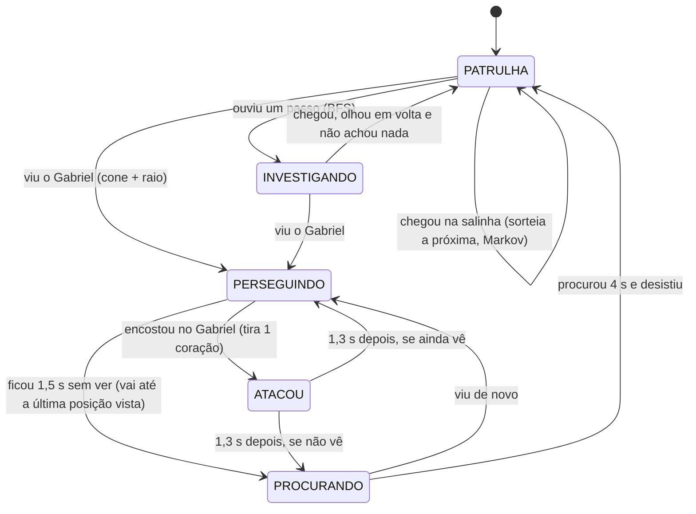

# Computação — Inteligência Artificial e Algoritmos de Perseguição

A inteligência dos robôs combina quatro estruturas algorítmicas canônicas da Computação: **BFS**, **A\***, **Cadeias de Markov** e **Máquinas de Estados Finitas (FSM)**.

---

## 1. Propagação de Som via Busca em Largura (BFS)

Quando Gabriel corre, esbarra em móveis ou arremessa uma pedra, um evento acústico com intensidade inicial $I_0$ é gerado no nó de origem $v_{origem}$.

- **O Algoritmo:** Uma Busca em Largura (BFS) expande a onda sonora camada por camada pelos nós vizinhos do grafo $G$.
- **Atenuação por Aresta:** A intensidade sonora decai a cada nó percorrido conforme o peso da aresta e o tipo de barreira:
  $$I_{vizinho} = I_{atual} - (\text{peso\_aresta} \times \alpha_{parede})$$
- **Detecção:** Se o robô estiver posicionado em um nó onde $I_{no} \ge \text{limiar\_audicao}$, seu estado muda para *Investigando*, e o nó de maior intensidade acústica vira seu destino imediato.

---

## 2. Perseguição Ativa via Algoritmo A\* (A-Star)

Quando a linha de visão é confirmada ou um ruído alto denuncia a posição de Gabriel, o robô engaja em perseguição direta calculando o caminho ótimo até a última posição conhecida do jogador:

- **Função de Custo:**
  $$f(n) = g(n) + h(n)$$
  - $g(n)$: Custo real acumulado no grafo desde a posição do robô até o nó $n$.
  - $h(n)$: Heurística admissível (distância euclidiana 2D em linha reta entre o nó $n$ e o nó do jogador).
- **Recálculo em Tempo Real:** O caminho é recalculado periodicamente (ex.: a cada 0.5s) para se adaptar caso Gabriel mude de rota ou atravesse portas e frestas.

---

## 3. Comportamento Errante via Cadeias de Markov

Quando um robô está fora da rotina e não detectou o jogador, ele não se move de forma totalmente aleatória nem segue rotas puramente estáticas. Seu movimento é modelado como um processo estocástico de Markov:

- **Espaço de Estados:** O conjunto de salas adjacentes $S = \{s_1, s_2, \dots, s_m\}$.
- **Matriz de Transição estocástica ($P_{ij}$):** A probabilidade de transitar da sala $i$ para a sala vizinha $j$:
  $$P_{ij} = \frac{e^{\beta \cdot \text{atratividade}(j)}}{\sum_{k \in \text{Vizinhos}(i)} e^{\beta \cdot \text{atratividade}(k)}}$$
- **Atratividade:** Salas com resquícios humanos, portas abertas recentemente ou onde o jogador foi visto no passado possuem maior probabilidade de transição, aumentando a sensação de perigo inteligente (modelo similar à IA de FNAF formalizada).

---

## 4. Máquina de Estados Finita (FSM)

Cada robô opera sob uma FSM com transições rigorosas:

- **ROTINA:** Executa a rota de patrulha atribuída pela grade horária.
- **INVESTIGANDO:** Move-se até o nó onde o som ou movimento suspeito foi registrado.
- **PERSEGUINDO:** Move-se na velocidade máxima calculada via $A^*$ em perseguição direta.
- **ATORDOADO:** Paralisado por 3 a 5 segundos após a detonação de uma cápsula de clarão.
- **RETORNANDO:** Caminha de volta à sala original prevista pela coloração de horários.

---

## 5. Como está implementado (Labirinto, 2026-09-29)

O primeiro uso real destes algoritmos é o **Labirinto** ([`../fases/labirinto.md`](../fases/labirinto.md)). O que está acima é o plano geral; esta seção descreve exatamente o que o código faz, para a apresentação.

Arquivos: `scripts/labirinto/grade_labirinto.gd` (grafo, A\*, BFS, Markov) e `scripts/personagens/robo.gd` (máquina de estados e sentidos).

### 5.1 Dois grafos
- **Grade de blocos** (37 × 25 células de 32 px): cada célula livre é um nó, ligado às 4 vizinhas livres. Usado pelo A\* e pela BFS.
- **Grafo lógico** (12 × 8 salinhas): cada salinha é um nó; há aresta entre duas salinhas vizinhas quando a parede entre elas foi derrubada. Usado pela patrulha (Markov).

### 5.2 Visão: produto escalar + raio
O robô olha numa direção $\vec{d}$ (vetor unitário). Seja $\vec{v}$ o vetor do robô até o Gabriel e $|\vec{v}|$ a distância. O Gabriel é visto se:

1. $|\vec{v}| \le \text{alcance}$, onde $\text{alcance} = \text{alcance\_visão} \times (1{,}7 \text{ se a lanterna está acesa})$;
2. está dentro do **cone**: $\vec{d} \cdot \dfrac{\vec{v}}{|\vec{v}|} \ge \cos\left(\dfrac{\theta}{2}\right)$, com $\theta$ = abertura do cone (Sentinela 60°, Rastreador 100°). O produto escalar de dois vetores unitários é o cosseno do ângulo entre eles, então basta comparar com o cosseno da metade da abertura: nada de arco-cosseno;
3. a **linha de visão está livre**: um raio (*ray casting*) do robô até o Gabriel, testando só a camada de colisão das paredes, não pode bater em nada.

Colado no robô (menos de 20 px), ele sente o Gabriel mesmo sem ver.

### 5.3 Audição: BFS pelos corredores
Cada passo do Gabriel emite o sinal `passo_dado(correndo)`. Cada robô faz uma **busca em largura** a partir da célula do Gabriel, com profundidade máxima:

$$\text{limite} = \begin{cases} 14 \times f & \text{correndo} \\ 5 \times f & \text{andando} \end{cases}$$

com $f$ = fator de audição do robô (Sentinela 0,5; Rastreador 1,8). Se a célula do robô é alcançada, ele ouviu e vai **investigar** o lugar.

A BFS anda pelos corredores, não em linha reta: um robô do outro lado de uma parede fina, a 2 células em linha reta mas a 20 células de corredor, **não ouve**. É exatamente a ideia da propagação de som do item 1, com distância em número de arestas.

### 5.4 Perseguição: A\*
`AStarGrid2D` do Godot sobre a grade de blocos (paredes marcadas como sólidas), com diagonais só quando não cortam quina de parede e heurística **octil** (a distância exata numa grade com 8 direções quando não há obstáculos, por isso admissível). Perseguindo, o robô recalcula o caminho até a última posição vista do Gabriel a cada 0,35 s.

### 5.5 Patrulha: cadeia de Markov no grafo lógico
Chegando numa salinha $i$, o robô sorteia a próxima entre as vizinhas abertas $j$, com pesos:

$$w_{ij} = \begin{cases} 0{,}15 & \text{se } j \text{ é a salinha de onde ele veio} \\ 1 & \text{caso contrário} \end{cases} \qquad P_{ij} = \frac{w_{ij}}{\sum_k w_{ik}}$$

Exemplo: numa salinha com 3 saídas, vindo de uma delas, as probabilidades são $1/2{,}15 \approx 0{,}465$ para cada saída nova e $0{,}15/2{,}15 \approx 0{,}07$ para voltar. Num beco sem saída ($1$ vizinha), volta com probabilidade 1.

Como a probabilidade depende de **onde ele está e de onde veio**, o estado da cadeia é o par (salinha atual, salinha anterior), ou seja, a **aresta** por onde o robô chegou. Com esse estado, a próxima escolha só depende do estado atual: é uma cadeia de Markov. O peso baixo de voltar faz o robô varrer o labirinto em vez de ficar indo e voltando no mesmo corredor.

### 5.6 Máquina de estados (a que está no código)

Ao entrar em PERSEGUINDO, o robô emite `jogador_detectado` (e toca o guincho); ao desistir, `jogador_perdido`. A sala escuta esses sinais para subir e descer a camada de perseguição da trilha.

O estado RETORNANDO do plano original não foi preciso: ao desistir, o robô recomeça a patrulha de onde está. O ATORDOADO volta quando existir a cápsula de clarão.
