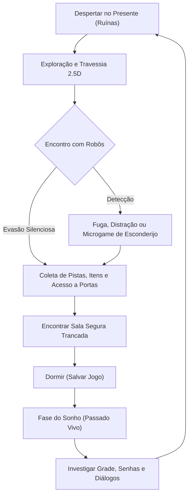

# Mecânicas — Visão Geral e Core Loop

Esta seção detalha todas as regras sistêmicas de jogabilidade de *Ankhor*, cobrindo locomoção, sobrevivência, iluminação, furtividade e a mecânica central do sono/sonhos.

---

## 🔄 O Loop Principal de Gameplay (Core Loop)

1. **Explorar Ruínas no Presente:** Navegar pelo campus desabado, recolhendo pilhas para a lanterna, bilhetes e itens-chave.
2. **Evitar e Sobreviver aos Robôs:** Usar passos lentos, esconderijos com microgames interativos, gestão de luz e arremesso de objetos de distração.
3. **Alcançar Sala Segura:** Localizar áreas estruturalmente intactas com trancas internas.
4. **Dormir para Salvar:** Salvar o progresso e transitar para a dimensão do sonho.
5. **Investigar o Passado:** Conversar com personagens, examinar o passado e encontrar códigos que abrem caminhos no presente.

---

## 📂 Detalhamento dos Módulos

- **[`movimentacao_e_terreno.md`](movimentacao_e_terreno.md):** Controles de locomoção, corrida, gestão de estamina, ruído de passos e navegação vertical/obstáculos.
- **[`furtividade_e_esconderijos.md`](furtividade_e_esconderijos.md):** Tipos de esconderijos (armários, cabines, raízes), microgames de tensão (respiração, imobilidade) e distrações.
- **[`iluminacao_e_lanterna.md`](iluminacao_e_lanterna.md):** A lanterna a pilha, o dilema ver/ser visto, as luzes de emergência e as cápsulas de clarão (previstas).
- **[`vida_e_checkpoint.md`](vida_e_checkpoint.md):** 3 corações, dano dos robôs, tela de morte e checkpoints.
- **[`itens_e_inventario.md`](itens_e_inventario.md):** Pegar, guardar, equipar e usar itens: inventário em grade (matriz), espaços de gadget e a lanterna.
- **[`hackeamento.md`](hackeamento.md):** Minigames do notebook para abrir portas trancadas (Sequência e Sincronia), em três dificuldades.
- **[`registros_e_caderno.md`](registros_e_caderno.md):** Ler os documentos dos antecessores, as transmissões de rádio do Rafael e o Caderno do Gabriel (aba Anotações do inventário, tecla N).
- **[`sono_e_sonhos.md`](sono_e_sonhos.md):** Arquitetura do sistema de save game e jogabilidade investigativa nos sonhos.
